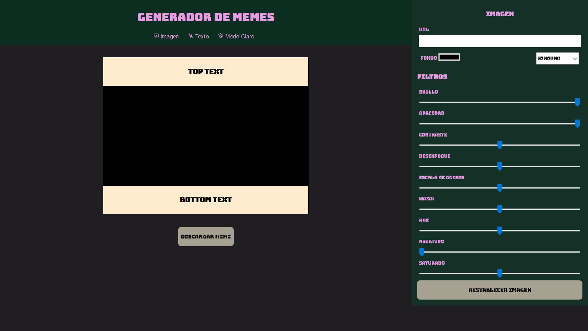

## Generador de memes de Hannah Carabolante

#### Este proyecto es un generador de memes realizado como evaluación, a partir de lo aprendido en el segundo módulo de la sexta generación de FRONTEND de [ADA](https://adaitw.org/).

<br>


***

### Si quiere echarle un vistazo puede darle click a este [enlace](https://carabolanteh.github.io/proyecto-memes-copy/).

<br>


***

### Si quiere tener el código en su computadora, deberá de seguir estos pasos en su terminal.

- Ir al [repositorio](https://github.com/carabolanteh/proyecto-memes-copy).
- Darle click al botón de forkear.
- Darle click al botón de code color verde.
- Copiar la url.
- Abrir tu terminal y poner el comando de  ```git clone <url>```.
- Entrar a la carpeta del proyecto y abrirlo en tu IDE.

### Este proyecto no necesita la instalación de ningua dependencia, por ahora!

<br>

***

### A continuación, le dejo una imagen ilustrativa de como debería de verse la página en su navegador.

<br>




<br>

***

<br>

### Este pagina web no sería lo que es sin la ayuda de [Jonh](https://github.com/Jonhks) [Leydy](https://github.com/leydyk93) y mis compañeras de curso. No me queda más que agradecerles. 🥰

<br>

***

#### De Hannah, con mucho ❤ 